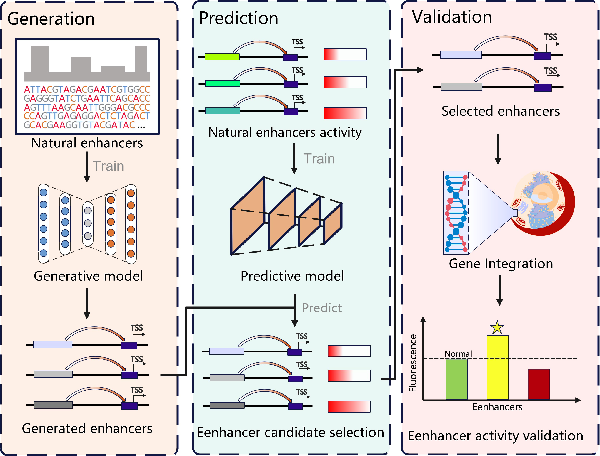

# Enhancer Sequence Generation and Strength Prediction

## 📖 Core Features
This repository contains two related models for enhancer sequence tasks:
### 🧬 Generative Model Architecture
- **Dual-Model Framework**: Integrates a VAE-Transformer generator and DNABERT2 predictor
- **Self-Attention Mechanism**: Captures local sequence motifs and global regulatory dependencies
- **Tissue-Specific Modeling**: Independent model training for 47 human tissue types
- **High-Quality Sequence Generation**: Preserves statistical and biological features of natural enhancers
### 🎯 Predictive Model Performance
- **DNABERT2 Fine-Tuning**: Enhancer activity prediction based on the pre-trained DNABERT-2 model
- **Epigenetic Integration**: Incorporates modification signals such as H3K27ac and H3K4me1
- **MPRA Data Validation**: Integrates large-scale massively parallel reporter assay datasets
- **Cross-Cell Line Application**: Supports multiple cell lines such as HepG2, K562, GM12878

## 📊 Data Scale and Quality
- **Data Sources**: Integration of 10 enhancer databases (HACER, HEDD, SEDB2.0, etc.)
- **Data Scale**: 847,392 unique enhancer sequences
- **Coverage**: 164 human tissue and cell types
- **Quality Control**: Sequence filtering and deduplication

## 🧪 Experimental Validation Results
### ✅ 100% Prediction Accuracy
- **Enhancer Validation**: All 6 predicted enhancer sequences exhibited significant transcriptional activation (2.1–4.7x, P<0.001)
- **Silencer Validation**: 2 predicted silencer sequences showed inhibitory effects (0.3–0.6x activity, P<0.01)
- **Dual-Luciferase Assay**: Validated in HepG2 and 293T cell lines

### 📈 Model Performance Metrics
- **Sequence Quality**: k-mer frequency correlation 0.867–0.923
- **Prediction Accuracy**: Pearson correlation 0.69–0.76 (MPRA data)
- **Classification Performance**: AUROC 0.83–0.88

## 🏗️ Project Structure
```
├── each-tissue-model/                # VAE-Transformer generator model
│   ├── each-tissue_train.py          # Training script
│   └── model-save/                   # Model save directory
├── each-tissue-prediction/           # DNABERT2 predictor model
│   ├── each-tissue-prediction.py     # Predictor training scripts
│   ├── dnabert2/                     # DNABERT2 model files
│   └── prediction-model-save/        # Prediction model save directory
├── work/                             # Research working directory
│   ├── generate-model/               # Generation-related models
│   ├── figure/                       # Visualization
└── experiment/                       # Experimental scripts
```

## 🛠️ Environment Requirements
### System Requirements
- Linux OS (Ubuntu 18.04+ recommended)
- CUDA-compatible GPU (RTX 4090 or Ada6000 recommended)
- Python 3.8+

### Core Dependencies
```bash
tensorflow>=2.8.0
torch>=1.12.0
transformers>=4.20.0
pandas>=1.4.0
numpy>=1.21.0
scikit-learn>=1.1.0
keras-tuner>=1.1.3
matplotlib>=3.5.0
seaborn>=0.11.0
```

## ⚙️ Installation Guide
### 1. Clone the Repository
```bash
git clone https://github.com/seasunshining/EnhancerTransGAN.git
cd EnhancerTransGAN
```

### 2. Using pip
```bash
pip install -r requirements.txt
```

### 3. Data Preparation
Ensure enhancer data files are located at:
```bash
/work/38liCQ/each-tissue/
```

## 🚀 Usage Guide
### VAE-Transformer Model Training
#### Basic Training
```bash
nohup python each-tissue-model/each-tissue_train.py > each-tissue-train.log 2>&1 &
```

### DNABERT2 Predictor Training
```bash
nohup python each-tissue-prediction/each-tissue-prediction.py > prediction.log 2>&1 &
```
